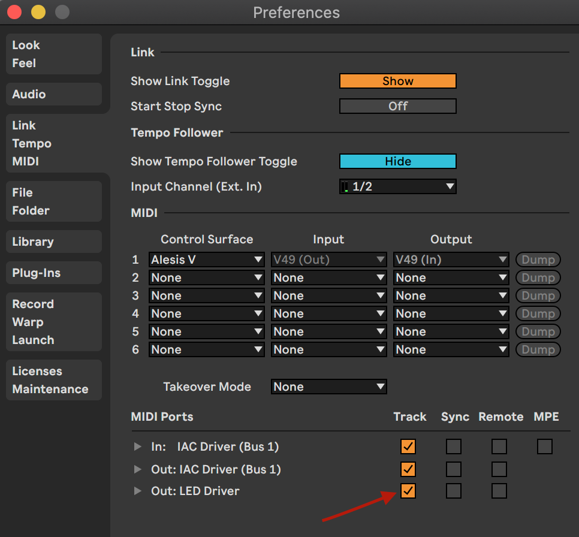

# 🌵 MIDI Neopixels

Control Neopixels via MIDI with a really simple color scheme!

## Getting started

First, you're going to need to install Node.js - Head to [https://nodejs.org/en/](https://nodejs.org/en/) and download and install the latest version (should be 14.16.0 LTS).

Once Node.js is installed, you're going to need to download this repo. We're gonna skip git and just use the basic released source code, which you can find in the [releases page](https://github.com/cannoneyed/neopixels/releases/tag/0.0.1). Download the [source code](https://github.com/cannoneyed/neopixels/archive/0.0.1.zip), unzip it, and move it somewhere easy to access.

Now, open up a terminal (type "terminal" into spotlight). Once your terminal is open, you'll need to navigate to the folder that you just unzipped. The easiest way to do this is by putting the unzipped folder on your desktop, and navigating to it like so:

```bash
cd ~/Desktop/neopixels-0.0.1
```

Once you're in the neopixels directory, we just need to install the dependencies in order to run the app.

```bash
# from ~/Desktop/neopixels-0.0.1
npm i
```

Now, everything should be ready.

Next, put together the Neopixel LEDs and controller and plug it in in the following order (probably not a big deal but I always did it this way):

- Plug the LED strip 3-pin connector into the driver 3-pin connector.
- Plug the DC power wall wart into an outlet and the barrel jack into the driver.
- Connect the USB cable, and plug into your computer.

Now start the LED driver application:

```bash
node index.js
```

You should see a message that says:

```bash
🌵 LED Driver Ready
```

Along with a series of messages indicating what the MIDI Notes are mapped to. More on that in a minute.

The LED Driver software opens up a Virtual MIDI device that you can connect to from any other application and send MIDI messages to. To do this from Ableton, open the preferences window and ensure that the "LED Driver" MIDI device is connected by toggling the "Track" checkbox on.



Now, create a track and output the MIDI to the "LED Driver" device. You should now be able to send MIDI messages to the running "LED Driver" application.


## MIDI Messages

The LEDs are triggered with a very simple schema for mapping MIDI notes to colors. These are defined in `config.json`, with a set of `triggers` and `fades`.

Each MIDI note maps to a specific LED on the strip, with the lowest note (C -2) corresponding to the first LED, (C# -2) corresponding to the second, and so forth. Each note's velocity determines what fade it will `trigger`. Let's take a look at the default config:

```json
{
  "triggers": [
    {
      "velocity": 100,
      "fade": "red_blue_black"
    },
    {
      "velocity": 101,
      "fade": "red_blue"
    }
  ],
  "fades": {
    "red_blue": {
      "from": [255, 0, 0],
      "to": [0, 0, 255],
      "duration": 500
    },
    "red_blue_black": [
      {
        "from": [255, 0, 0],
        "to": [0, 0, 255],
        "duration": 500
      },
      {
        "from": [0, 0, 255],
        "to": [0, 0, 0],
        "duration": 500
      }
    ]
  }
}
```

A C-1 MIDI note with velocity 101 will trigger the fade `red_blue`. Fades are indexed by a unique name, and consist of one or more steps from one color to another. Colors are represented with an array of `[r, g, b]` values. The `red_blue` fade will go from pure red (`[255, 0, 0]`) to pure blue (`[0, 0, 255]`) in 500ms.

Fades can also have multiple steps by using an array of individual fades. In the case of the `red_blue_black` fade, the LED will go from red to blue over 500 ms and then from blue to black over the next 500ms. This is really helpful for making "attacks" or "releases" of the individual blinks.

You can create your own mappings and fades by simply editing the config.json file, and then reloading the app. Reload by hitting `ctrl + c` in the terminal and then restarting the app.

```bash
# hit ctrl+c to exit
node index.js # to restart
```

## Handy hints

To compute the number of ms in one beat, use the following formula:

```
ms_per_beat = 1 / (bpm / 60) * 1000
```

In this case, a bpm of 128 would give a ms_per_beat of 468.75. An eighth note would be half that (234.375), and a sixteenth would be half that (117.1875).

And remember, when editing the JSON file - make sure your brackets line up and all keys have quotation marks (`""`) around them!
